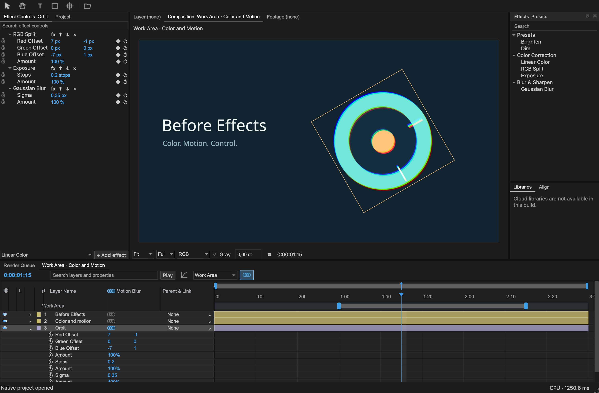

# B4 — Before Effects

B4 is an independent motion-design and compositing editor built in C++20 and Qt. It aims for a familiar After Effects workflow while keeping its implementation, name, and visual assets original. The current codebase is a **0.7.0 developer alpha**; full After Effects capability and interoperability are not complete.

[Download the macOS alpha](https://github.com/edwin0912-00/b4/releases/tag/v0.7.0-alpha.1) · [Build from source](docs/public/BUILD.md) · [Contribute](CONTRIBUTING.md)



The initial alpha targets **Apple Silicon Macs running macOS 26.0 or newer**. The application bundle is named **Before Effects.app**. It is ad-hoc signed and not notarized; macOS may require its standard user approval before opening the downloaded app. Windows, Intel Mac, and Linux builds are not supported in this release.

## What works in 0.7

- Editable 2D compositions with text, solids, PNG images, video, and audio.
- Transform and opacity keyframes, easing, value/speed graphs, parenting, precompositions, and rectangular/elliptical masks.
- An ordered stack of four native effects: Linear Color, RGB Split, Exposure, and Gaussian Blur.
- Viewer channel inspection, independent viewing exposure, transform-only motion blur, and a saved Work Area for preview and render ranges.
- PNG sequence and H.264/AAC MP4 export.

These are original Before Effects policies and implementations. The alpha does not claim pixel or interaction parity for unmeasured After Effects behavior. See [Effects, viewing and motion](docs/effects-motion.md) and [Work Area](docs/work-area.md) for exact controls, defaults, and limits. [Features](docs/public/FEATURES.md) lists what is and is not implemented.

## Open the examples

The repository includes three editable native JSON projects:

- `fixtures/original-scene.json` — animated title and image in a short composition.
- `fixtures/effects-motion-demo.json` — effect stack and transform motion blur.
- `fixtures/work-area-demo.json` — a three-second composition with an editable Work Area.

After building, open the app with:

```sh
open "build/Before Effects.app"
```

The `.b4p` code-to-Timeline project format is a proposal and is not implemented. The current native project format is JSON.

## Build and test

Install the pinned Qt 6.12.0 SDK and build tools using [Build](docs/public/BUILD.md), then run from the repository root:

```sh
cmake -S . -B build -DCMAKE_BUILD_TYPE=Release \
  -DCMAKE_PREFIX_PATH="$PWD/.qt/6.12.0/macos" \
  -DCMAKE_OSX_SYSROOT="$(xcrun --sdk macosx --show-sdk-path)" \
  -DCMAKE_OSX_ARCHITECTURES=arm64 -DCMAKE_OSX_DEPLOYMENT_TARGET=26.0
cmake --build build --parallel 3
ctest --test-dir build --output-on-failure
```

This runs the 14 registered CTest checks. See [Build](docs/public/BUILD.md) for the full environment and release details.

## Project status

B4's original code is licensed under [MPL-2.0](LICENSE). Third-party libraries and fonts retain their own licenses; see [third-party notices](THIRD-PARTY-NOTICES.md). Read the [Roadmap](docs/public/ROADMAP.md), [contribution guide](CONTRIBUTING.md), [security policy](SECURITY.md), and [code of conduct](CODE_OF_CONDUCT.md) before participating.

General `.aep` import/export, native After Effects plug-in hosting, the wider AE feature set, HDR/color management, 3D, tracking, rotoscoping, and other operating systems remain unsupported or future work. The isolated plug-in experiment is not part of the application. No public build should be described as full After Effects parity.
